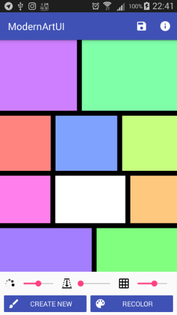

# What is it?
This is the first app I made from scratch. I made it as the final assignment of the Coursera's course "Programming Mobile Application for Android Handheld Systems: Part 1". The original assignment was simpler, I preferred to experiment a little bit more with Android :)

It's basically a generator of "artworks" which you can save as png images. Here's a screenshot

It allows you to set:

* the color saturation (excluding white rectangles), 
* the black stroke width 
* the "granularity" of the artwork (technically, the  maximum depth of the tree representing the artwork). 

You can also randomly recolor the artwork globally or shift the hue of an individual rectagle clicking on it (except the white rectangles).

## Video
A video of the app can be find at the following link: https://www.youtube.com/watch?v=bqhVjzkbDKQ.

## Original requirements of the assignment
Though I made a different app from that required by the assignment, I incorporated the requirements of the original assignment in this app (this should explain the weird design choices about white rectangles):

1. every artwork has at least one white rectangle
2. there's a slider (the saturation one) that affects the color of all the rectangles but the white ones
3. there's a "Info" dialog containing a link to the MOMA site.

