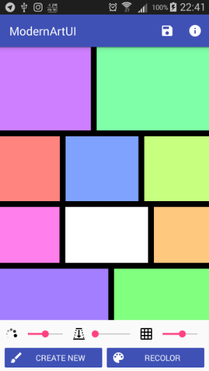

# What is it?

[Watch the video](https://www.youtube.com/watch?v=bqhVjzkbDKQ)
Note: the video shows a previous version of the app, the one that was peer-reviewed by other 
Coursera students. I made some changes to the generation algorithm since then but the app looks
pretty much the same.

This is the first Android app I made from scratch. I wrote it for the final assignment of the
Coursera's course "Programming Mobile Application for Android Handheld Systems: Part 1", but it's a
more complex version of the original assignment, which was about composing a fixed layout showing an 
fixed "artwork". Instead, I made a generator of "artworks" that you can save as png images.

Note that all the constraints of the original assignment were satisfied: 
- the app has at least a slider for changing the colors of the tiles;
- the artwork has at least a white tile that remains white even when the slider position is changed.

Here's a screenshot:

The three sliders, from left to right, allow you to set:

* the color saturation (white rectangles remain white as of assignment constraint);
* the "granularity" of the artwork; technically, it's the maximum depth of the tree representing the artwork;
* the black stroke width.

You can also randomly recolor the entire artwork or shift the hue of an individual rectangle
(except white rectangles) tapping on it.
